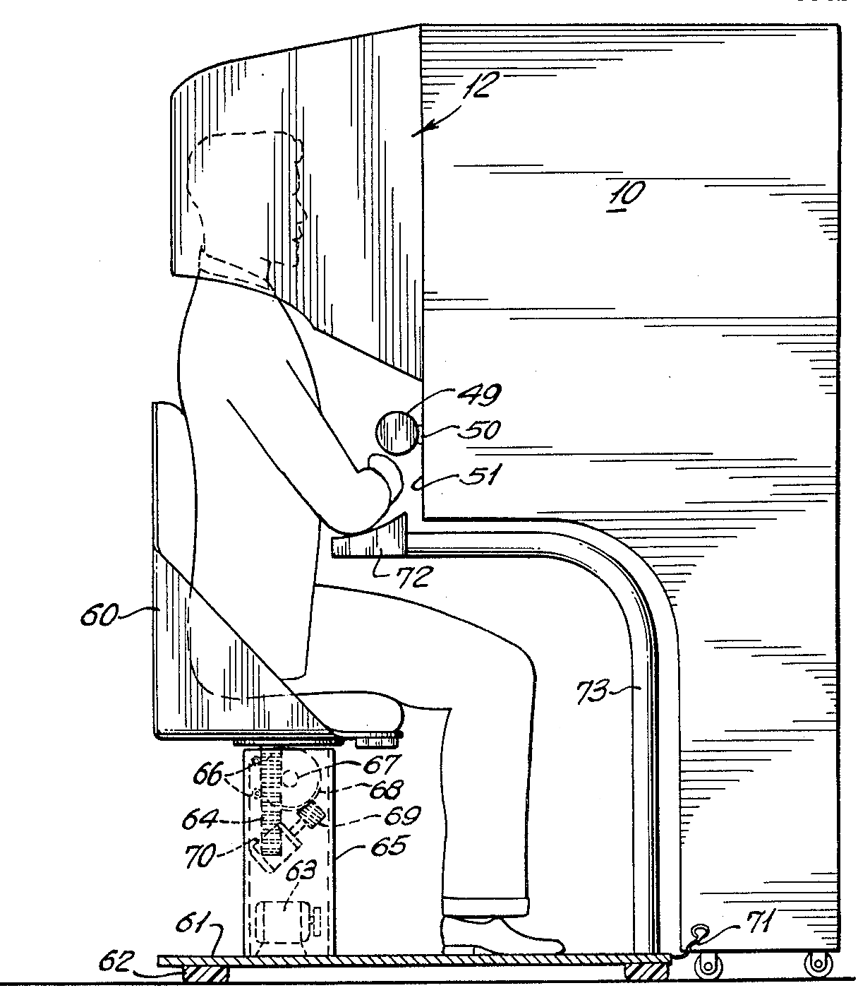

### IM - Digital Trends - Heig-VD
# VR Tech - Etat de l'art      
      
### Sommaire
- [Les applications actuelles et futures de la VR](#application-vr)
- [Historique](#histo)
- [Le matériel VR](#materiel)
- Exemples d'app à succès
- Immersion
- Déplacements
- Performances graphiques
- Audio
- Réflexion/discussion: UX et interfaces de jeux VR

## Applications de la VR

### Quelles applications à la VR ?

- Marketing
- Jeux vidéos
- Musées
- Prototypage
- Education/formation (médecine, ...)
- Télétravail
- Cinéma (animations)

#### La VR, un média qui englobe tous les autres ?

##  Historique

XIXe s. - Peintures panoramiques

XIXe s. - Stéréoscopes

XXe s. - View-Master

Début XXe s. - [Link Trainer](https://en.wikipedia.org/wiki/Link_Trainer)

Années 50 - Sensorama + 6 films, par Morton Heilig

Années 60 - Telesphere Mask, premier head-mounted display (HMD), par M. Heilig

1961 - Headsight, premier HMD avec motion tracking, par Comeau et Bryan

1968 - The Sword of Damocles, premier dispositif VR, par Ivan Sutherland

1981 - ASPEN MOVIE MAP, propotype de cartes interactives, par le MIT

1990 - NASA-VIEW (Virtual Interface Environment Workstation), casque, gants et combinaison connectés

1992 - [SEGA VR/R360](https://oculusnext.com/sega-vr/)

2011 - My3D Hasbro

2013 - Oculus Rift

2014 - Google Carboard

 ...

## Le matériel VR

### Degrès de liberté

3DOF: Three Degrees Of Freedom ou suivi de rotation

6DOF: Six Degrees Of Freedom ou suivi de position

### Systèmes de  suivi de position (*positional tracking*)

- Outside-in (Oculus camera ir, Valve lighthouse, ...)
- Inside-out tracking (simultaneous localization and mapping [SLAM](https://en.wikipedia.org/wiki/Simultaneous_localization_and_mapping))

### Contrôleurs et systèmes d'interaction VR

### Casques autonomes versus casques reliés

### Casques populaires récents
| Casques             | Platforme  | 6DOF | Contrôleurs | Contrôleurs 6DOF |
|:--------            |----------:|:----:|:-----------:|:----------------:|
| HTC Vive Cosmos     | PC         | ✔️    | ✔️          | ✔️                |
| Oculus Rift S       | PC         | ✔️    | ✔️          | ✔️                |
| Oculus Quest        | Standalone | ✔️    | ✔️          | ✔️                |
| Oculus Go           | Standalone | ❌   | ✔️          | ❌               |
| Google Cardboard    | Android    | ❌   | ❌         | ❌                |
| Sony Playstation VR | Playstation| ✔️    | ✔️           | ✔️                |

# Quelques applications de références

- [Beat Saber](https://beatsaber.com/)
- Inclut: musique, espace, profondeur
- Sans textes, sans déplacements du joueur (ou légers)
- Dispo: Steam, oculus store, PS, Humble bundle
- [Google earth VR](https://www.youtube.com/watch?v=SCrkZOx5Q1M&feature=youtu.be)
- Interface intéressante: déplacer le soleil (jour/nuit)
- Pas de téléportation, on amène l'endroit choisi à soi

De manière générale, une application VR ne doit pas permettre de prendre le contrôle de la caméra. Problème: [mal du voyage ou motion sickness](https://en.wikipedia.org/wiki/Virtual_reality_sickness).

# Etat de l'art: Immersion

- Le [Field of view](https://vr-lens-lab.com/field-of-view-for-virtual-reality-headsets/) (FOV) n'est pas optimal sur les casques actuels
- le FOV des devices = en moyenne 90-110°
- le FOV humain = 200-220°

[*Source*](https://fr.wikipedia.org/wiki/Champ_visuel#/media/Fichier:Champ_vision.svg)

## Le casque (gênant, lourd)
- Deep Diving: jeu de plongée VR - détourne ce problème
- https://store.steampowered.com/app/1104050/Deep_Diving_VR/

## [Screen Door Effect (SDE)](https://www.howtogeek.com/404491/what-is-the-screen-door-effect-in-vr/)
- L'effet: on voit le "grillage" de pixels
- Cause: zoom sur l'écran dans le headset, en plus du fait qu'il est proche des yeux
- Solution: meilleure résolution de l'écran (8K)

[*Source*](https://en.wikipedia.org/wiki/Screen-door_effect#/media/File:Screen-door_effect.jpg)

## [Mura Effect](https://www.roda-computer.com/technology/mura-effect/)
- L'effet: les à-plats de couleurs ne sont pas homogènes
- Cause: la composition des écran empêche une luminosité tout à fait régulière

##  [Aliasing](https://fr.wikipedia.org/wiki/Anticr%C3%A9nelage)
- L'effet: les arrondis sont saccadés
- Cause: les pixels sont carré, les courbes sont pas possible sur écran
- Anti-aliasing: technique  d'"anticrénelage" (FR) pour lisser les courbes et diagonales, grâce au flou

## [Glare ou God rays](https://3dinsider.com/vr-lenses/)
- L'effet: En cas de forts contrastes, ça "bave". On voit les rayons lumineux.
- Cause: Les lentilles dans le casques.
- Solution: limiter les forts contraste dans le design du jeu/de l'app.

# Etat de l'art: Déplacements
### Les déplacements sont problématiques dans la VR.
## Problèmes:
- Mal du voyage (ou moiton sickness) lorsque le déplacement visualisé est décalé de celui contrôlé par l'utilisateur.
- L'espace réel est souvent restreint: dans une pièce, souvent 2-3m2

### Comment garder le réalisme des déplacements, sans les permettre en réalité?

### Différentes solutions
- **Le chaperon**: faire des murs virtuels quand y a des murs en realité. Mais qu'en est-il pour les mondes infinis?
- Utiliser des **véhicules**: l'utilisateur reste sur place en réalité, c'est le véhicule qui se déplace dans le virtuel.
- **La téléportation**: l'utilisateur ne bouge pas.
- **[Rediect walking](https://www.youtube.com/watch?v=u8pw81VbMUU)**: fausser la perception de l'esprit avec un décalage mouvements réels/virtuels.
- **Suites de mouvements adaptées à l'univers**, pensés pour que l'utilisateur revienne sur ses pas, et reste dans un espace restreint.

### Différentes solutions (suite)
- **Overlapping** des salles pour fausser l'esprit: jeu des distances. Difficile pour le cerveau de se représenter les distances.

### Différentes solutions (suite)

- **Tapis VR**: permet le déplacement infini. Le problème: ils sont dangereux, besoins de harnais, ou d'une sécurité de soutien.

# Etat de l'art: Performances graphiques
L'idéal serait d'avoir une résolution min. de 8k, avec un FOV de 180°, et une fréquence min. de 90Hz

Le problème: les cartes graphiques actuelles ne le permettent pas.

**Quelques solutions:**
- **[Le foveated rendering](https://en.wikipedia.org/wiki/Foveated_rendering)**: on améliore le centre de l'image, et de moins en moins en plriphérie de la vision pour réduire le temps de calcul. Avec du eye-tracking intégré aux casque cela pourrait être d'autant plus performant. 
- **[Asynchronous interleaved reprojection](https://en.wikipedia.org/wiki/Asynchronous_reprojection)**: des images sont chargées, puis adaptées avec les informations de mouvements du casque. 

Voir: [Google light field](https://www.blog.google/products/google-ar-vr/experimenting-light-fields/)
et [Light-field camera](https://en.wikipedia.org/wiki/Light-field_camera)

# Etat de l'art: le son en VR
## Le son en VR est positionnel, donc également en 3D.
En savoir plus: [VR positional Audio](https://realnewworld.com/vr-positional-audio/)

# Réflexion/discussion:
## UX/interface de jeux VR, quelles problématiques?

# Sources
- [Virtual Reality Society](https://www.vrs.org.uk/virtual-reality/history.html)
- [Geek.com](https://www.geek.com/news/the-history-of-virtual-reality-games-1652225/)
- [Changing the world: DARPA’s top inventions](https://www.extremetech.com/extreme/105117-inventing-our-world-darpas-top-inventions/2)
<!--stackedit_data:
eyJoaXN0b3J5IjpbNTcyNzU5ODMzLC0yMDY2MjgwNTY5LC0xNj
Y2MjA2NDExLC0yMDk1NjEyMDU0LDEwNzc0MDg0ODQsLTE1Njcx
NDYwODMsLTg4MDE2MTMxMl19
-->