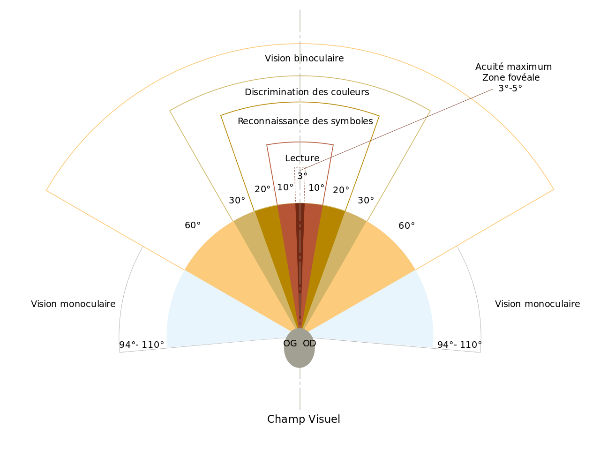
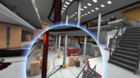

### IM - Digital Trends - Heig-VD
# VR Tech - Etat de l'art      
      
### Sommaire
- [Les applications actuelles et futures de la VR](#application-vr)
- [Historique](#histo)
- [Le matériel VR](#materiel)
- Exemples d'app à succès
- Immersion
- [Déplacements](#movements)
- Performances graphiques
- Audio
- Réflexion/discussion: UX et interfaces de jeux VR

## Applications de la VR

### Quelles applications à la VR ?

- Marketing
- Jeux vidéos
- Musées
- Prototypage
- Education/formation (médecine, ...)
- Télétravail
- Cinéma (animations)

#### La VR, un média qui englobe tous les autres ?

##  Quelques exemples historiques

XIXe s. - [Peintures panoramiques](https://fr.wikipedia.org/wiki/Panorama_(peinture))

XIXe s. - [Stéréoscopes](https://fr.wikipedia.org/wiki/St%C3%A9r%C3%A9oscope)

1929 - [Link Trainer](https://en.wikipedia.org/wiki/Link_Trainer)

1939 - [View-Master](https://fr.wikipedia.org/wiki/View-Master)

1960 - Telesphere Mask, premier head-mounted display (HMD), Morton Heilig

1961 - Headsight, premier HMD avec motion tracking, par Comeau et Bryan

1962 - [Sensorama, Morton Heilig](https://en.wikipedia.org/wiki/Sensorama)

1968 - [The Sword of Damocles](https://en.wikipedia.org/wiki/The_Sword_of_Damocles_(virtual_reality)), premier dispositif VR, par Ivan Sutherland

1978 - [ASPEN MOVIE MAP](https://en.wikipedia.org/wiki/Aspen_Movie_Map), propotype de cartes interactives, par le MIT

1990 - [NASA-VIEW (Virtual Interface Environment Workstation)](https://www.nasa.gov/ames/spinoff/new_continent_of_ideas), casque, gants et combinaison connectés

1992 - [SEGA VR/R360](https://oculusnext.com/sega-vr/)

1995 - [Virtual Boy](https://en.wikipedia.org/wiki/Virtual_Boy)

2012 - [Oculus Rift](https://en.wikipedia.org/wiki/Oculus_Rift)

2014 - [Google Cardboard](https://en.wikipedia.org/wiki/Google_Cardboard)

 ...

## Le matériel VR

### Degrés de liberté

3DOF: Three Degrees Of Freedom ou suivi de rotation

6DOF: Six Degrees Of Freedom ou suivi de position

### Systèmes de  suivi de position (*positional tracking*)

- Outside-in (Oculus camera ir, Valve lighthouse, ...)
- Inside-out tracking (simultaneous localization and mapping [SLAM](https://en.wikipedia.org/wiki/Simultaneous_localization_and_mapping))

[https://uploadvr.com/how-vr-tracking-works/](https://uploadvr.com/how-vr-tracking-works/)

### Contrôleurs et systèmes d'interaction VR
- Gaze contrôleur ?
- 3DOF contrôleur
- 6DOF contrôleur
- *Tracking* des doigts
- autres systèmes

### Casques autonomes versus casques reliés

### Casques populaires récents
| Casques             | Platforme  | 6DOF | Contrôleurs | Contrôleurs 6DOF |
|:--------            |----------:|:----:|:-----------:|:----------------:|
| HTC Vive Cosmos     | PC         | ✔️    | ✔️          | ✔️                |
| Oculus Rift S       | PC         | ✔️    | ✔️          | ✔️                |
| Oculus Quest        | Standalone | ✔️    | ✔️          | ✔️                |
| Oculus Go           | Standalone | ❌   | ✔️          | ❌               |
| Google Cardboard    | Android    | ❌   | ❌         | ❌                |
| Sony Playstation VR | Playstation| ✔️    | ✔️           | ✔️                |

# Quelques applications de références

- [Beat Saber](https://beatsaber.com/)
- Inclut: musique, espace, profondeur
- Sans textes, sans déplacements du joueur (ou légers)
- Dispo: Steam, oculus store, PS, Humble bundle
- [Google earth VR](https://www.youtube.com/watch?v=SCrkZOx5Q1M&feature=youtu.be)
- Interface intéressante: déplacer le soleil (jour/nuit)
- Pas de téléportation, on amène l'endroit choisi à soi

De manière générale, une application VR ne doit pas permettre de prendre le contrôle de la caméra. Problème: [mal du voyage ou motion sickness](https://en.wikipedia.org/wiki/Virtual_reality_sickness).

# Etat de l'art: Immersion

- Le [Field of view](https://vr-lens-lab.com/field-of-view-for-virtual-reality-headsets/) (FOV) n'est pas optimal sur les casques actuels
- le FOV des devices = en moyenne 90-110°
- le FOV humain = 200-220°

[*Source*](https://fr.wikipedia.org/wiki/Champ_visuel#/media/Fichier:Champ_vision.svg)

## Le casque (gênant, lourd)
- Deep Diving: jeu de plongée VR - détourne ce problème
- https://store.steampowered.com/app/1104050/Deep_Diving_VR/

## [Screen Door Effect (SDE)](https://www.howtogeek.com/404491/what-is-the-screen-door-effect-in-vr/)
- L'effet: on voit le "grillage" de pixels
- Cause: zoom sur l'écran dans le headset, en plus du fait qu'il est proche des yeux
- Solution: meilleure résolution de l'écran (8K)

[*Source*](https://en.wikipedia.org/wiki/Screen-door_effect#/media/File:Screen-door_effect.jpg)

## [Mura Effect](https://www.roda-computer.com/technology/mura-effect/)
- L'effet: les à-plats de couleurs ne sont pas homogènes
- Cause: la composition des écran empêche une luminosité tout à fait régulière

##  [Aliasing](https://fr.wikipedia.org/wiki/Anticr%C3%A9nelage)
- L'effet: les arrondis sont saccadés
- Cause: les pixels sont carré, les courbes sont pas possible sur écran
- Anti-aliasing: technique  d'"anticrénelage" (FR) pour lisser les courbes et diagonales, grâce au flou

## [Glare ou God rays](https://3dinsider.com/vr-lenses/)
- L'effet: En cas de forts contrastes, ça "bave". On voit les rayons lumineux.
- Cause: Les lentilles dans le casques.
- Solution: limiter les forts contraste dans le design du jeu/de l'app.

## Déplacements

### Principales problématiques

- Mal des transports ( *cinétose* ): se produit lorsque le déplacement visualisé est décalé de celui contrôlé par l'utilisateur.
 
- L'espace réel est souvent restreint à une petite partie d'une pièce, souvent entre 1 et 3 [m^2] alors que l'espace virtuel est d'une taille quelconque. 

- L'espace réel peut contenir des obstacles aux déplacements qui seront invisibles en VR. Et inversement, une chaise dans la réalité virtuelle ne sera (peut-être) pas physiquement présente dans la réalité.

### Déplacements et "mal des transports" (cinétose)

Une des principales règles pour éviter ce problème et de ne jamais prendre le contrôle de la caméra et donc de la laisser être contrôlée par le système de positionnement du casque VR.  

Si l'on veut tout de même déplacer l'avatar de l'utilisateur (et donc sa caméra) dans la VR sans que celui-ci se déplace dans la réalité, il va falloir trouver des "trucs" pour le faire de la manière la plus confortable possible.  Le critère de **confort** se retrouve d'ailleurs dans la plupart des magasins d'applications VR (par ex. dans [l'oculus store](https://support.oculus.com/1639053389725739/)). Voilà quelques exemples de solutions :

### Téléportation

Elle ne provoque généralement pas d’inconfort, mais elle peut casser l’immersion si elle n'est pas *scénarisée* dans l'application. C'est la solution la plus utilisée dans les applications VR d'aujourd'hui. On la retrouve sous différentes variantes dont voici quelques exemples concrets:

 - **Téléportation simple** :  l'avatar est simplement téléporté vers la destination. Elle est souvent soit **libre**: l'utilisateur choisit sa destination pour la téléportation dans l'espace VR visible (et accessible), soit **limitée**: par une série de marqueurs de téléportation disposés dans l'espace VR. La téléportation limitée est souvent utilisée lors de l'utilisation de la  [photogrammétrie](https://fr.wikipedia.org/wiki/Photogramm%C3%A9trie). L'application [Welcome to Light Fields](https://www.blog.google/products/google-ar-vr/experimenting-light-fields/) en est un bon exemple. En effet puisque l'espace VR n'est pas pleinement explorable (ce sont des *photos*), l'utilisateur se téléporte alors d'un point de vue à un autre, où les points de téléportation sont les endroits ou les *photos* ont été prises.
 
 - **Portails de téléportation** :  au lieu de téléporter l'utilisateur, on le fait passer à travers des portails reliant deux zones VR distantes. Ces portails peuvent être soit fixés par les créateurs de l'application, soit par l'utilisateur lui-même (à la manière du jeu [Portal](https://fr.wikipedia.org/wiki/Portal_(jeu_vid%C3%A9o))). Un bon exemple d'utilisation de ce système est le jeu [Budget Cut](https://store.steampowered.com/app/1092430/Budget_Cuts_2_Mission_Insolvency/). 
 
 
 
 
 
 - **Autres systèmes de téléportation** :  On peut imaginer d'autres systèmes de téléportation que ceux précités. Par exemple, le système de téléportation du jeu [The Gallery](https://en.wikipedia.org/wiki/The_Gallery_(video_game)), offre au joueur la possibilité d'orienter sa téléportation dans une direction bien précise en faisant apparaître au sol l'espace réel du joueur durant la sélection de la zone de téléportation (système [*blink*](https://www.youtube.com/watch?v=fOFgAfuTtyo&feature=emb_title)). 
 
 ### Simulateurs
 
Si les déplacements sont fait via un simulateur de véhicule (voitures, avions, vaisseaux spatiaux, etc..), les risques de *cinétose* sont fortement réduits. En effet, le mal du voyage atteint rarement celui qui est maître du véhicule, mais plutôt ses passagers. Un exemple est le jeu [Elite Dangerous](https://www.elitedangerous.com/), ou le joueur reste toujours assis dans son siège (même lors des phases d'exploration de la surface d'une planète, puisque celle-ci se fait aussi dans un véhicule terrestre). L'immersion est encore plus forte si l’utilisateur utilise des contrôleurs adaptés à la simulation (comme un [HOTAS](https://fr.wikipedia.org/wiki/Mains_sur_manche_et_manette) pour Elite Dangerous).  De plus, les simulateurs bénéficient aussi d'une grande possibilité d'immersion (la chaise existant dans le monde physique) et de confort (une séance de jeu prolongée est généralement plus appréciée en position assise :).  

### Déplacements libres

Si toutefois on opte pour des déplacements libres de la caméra via un contrôleur quelconque (clavier, croix directionnel, stick analogique, ... ), il faut éviter de faire simplement bouger la caméra sans autre forme d'artifice sous peine de provoquer un inconfort certain pour beaucoup de personnes. Le jeu [Raw Data](https://survios.com/rawdata/) utilise un système de *sprint* (ou *dash*) très rapide et  très proche de la téléportation. L'effet est quasi identique mais brise moins l'immersion. Toutefois, pour que cela ne provoque pas trop la *cinétose* la vision doit être floutée autour de la zone fovéale. Dans [Google Earth VR](https://arvr.google.com/earth/), la même méthode de *flou fovéale* est utilisée lors de l'utilisation du mode de déplacement "vol" (*flight mode*).

### Autres artifices

Si l'espace VR est de taille identique ou plus petit que l'espace réel, il n'y a pas trop de problème de déplacement. Il suffit à l'utilisateur de se déplacer dans la réalité pour être déplacé dans la VR de manière identique en utilisant simplement le système de positionnement du casque. Bien sûr pour que cela soit praticable, il faut que l'application aie connaissance de la taille réel de l'espace disponible par le joueur. L'expérience immersive [theBlu]([https://wevr(https://wevr.com/theblu)) 

Toutefois, si l'espace VR est plus grand que l'espace réel, il existe des méthodes pour éviter de devoir déplacer la caméra de l'utilisateur :

- **[Rediect walking](https://www.youtube.com/watch?v=u8pw81VbMUU)**: fausser la perception de l'esprit avec un décalage mouvements réels/virtuels.

- **Suites de mouvements adaptées à l'univers**, pensés pour que l'utilisateur revienne sur ses pas, et reste dans un espace restreint.
 
- **Drag and drop** : 

- **Overlapping** des salles pour fausser l'esprit: jeu des distances. Difficile pour le cerveau de se représenter les distances.

- **Tapis VR**: permet le déplacement infini. Le problème: ils sont dangereux, besoins de harnais, ou d'une sécurité de soutien.

- **Le chaperon**: faire des murs virtuels quand y a des murs en realité. Mais qu'en est-il pour les mondes infinis ?

# Etat de l'art: Performances graphiques
L'idéal serait d'avoir une résolution min. de 8k, avec un FOV de 180°, et une fréquence min. de 90Hz

Le problème: les cartes graphiques actuelles ne le permettent pas.

**Quelques solutions:**
- **[Le foveated rendering](https://en.wikipedia.org/wiki/Foveated_rendering)**: on améliore le centre de l'image, et de moins en moins en plriphérie de la vision pour réduire le temps de calcul. Avec du eye-tracking intégré aux casque cela pourrait être d'autant plus performant. 
- **[Asynchronous interleaved reprojection](https://en.wikipedia.org/wiki/Asynchronous_reprojection)**: des images sont chargées, puis adaptées avec les informations de mouvements du casque. 

Voir: [Google light field](https://www.blog.google/products/google-ar-vr/experimenting-light-fields/)
et [Light-field camera](https://en.wikipedia.org/wiki/Light-field_camera)

# Etat de l'art: le son en VR
## Le son en VR est positionnel, donc également en 3D.
En savoir plus: [VR positional Audio](https://realnewworld.com/vr-positional-audio/)

# Réflexion/discussion:
## UX/interface de jeux VR, quelles problématiques?

# Sources
- [Virtual Reality Society](https://www.vrs.org.uk/virtual-reality/history.html)
- [Geek.com](https://www.geek.com/news/the-history-of-virtual-reality-games-1652225/)
- [Changing the world: DARPA’s top inventions](https://www.extremetech.com/extreme/105117-inventing-our-world-darpas-top-inventions/2)
<!--stackedit_data:
eyJoaXN0b3J5IjpbMTM0MTcxMzY3MSwtOTQzMjQ2NDMwLDE4OD
kzOTk2NCwtMzcwNjcwOTcxLC0xNjMxMTM2Mjk4LC0xNzA0MTI1
MDg3LC00OTU0NzY4NDMsMTM2ODk5MzE3MiwxNjk2NzA3NjAwLC
0xODE5MTY5NzkzLDI5OTMwMjMxMiwtMTk3OTQ4NjAzOSwtMjEx
OTMzODAwNCw1NTE3NTg1NjQsLTEyODU1NzMzMDIsNDY2MzQ5NT
U0LC0yODA5NDA5NTAsNjc2MzQ5Mjc5LDE4MDUzMDQ2ODUsMTM2
MTEzNTM3NV19
-->