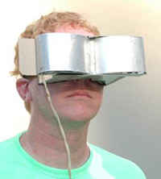
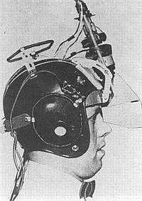
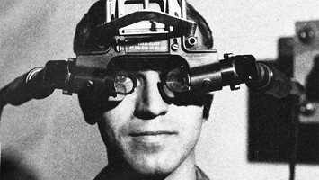
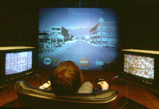
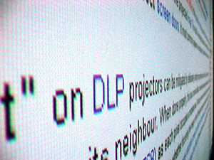
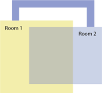

### IM - Digital Trends - Heig-VD
# VR Tech - Etat de l'art      
      
### Sommaire
- [Les applications actuelles et futures de la VR](#application-vr)
- [Historique](#histo)
- [Le matériel VR](#materiel)
- [Immersion](#immersion)
- [Déplacements](#movements)
- Performances graphiques
- Audio
- Réflexion/discussion: UX et interfaces de jeux VR

## Applications de la VR

### Quelles applications à la VR ?

- Marketing
- Jeux vidéos
- Musées
- Prototypage
- Education/formation (médecine, ...)
- Télétravail
- Cinéma (animations)
- ...

La VR, un média qui englobe tous les autres ?

##  Quelques exemples historiques

XIXe s. - [Peintures panoramiques](https://fr.wikipedia.org/wiki/Panorama_(peinture))

XIXe s. - [Stéréoscopes](https://fr.wikipedia.org/wiki/St%C3%A9r%C3%A9oscope)

1929 - [Link Trainer](https://en.wikipedia.org/wiki/Link_Trainer)

1939 - [View-Master](https://fr.wikipedia.org/wiki/View-Master)

1960 - Telesphere Mask, premier head-mounted display (HMD), Morton Heilig

1961 - Headsight, premier HMD avec motion tracking, par Comeau et Bryan

1962 - [Sensorama, Morton Heilig](https://en.wikipedia.org/wiki/Sensorama)

1968 - [The Sword of Damocles](https://en.wikipedia.org/wiki/The_Sword_of_Damocles_(virtual_reality)), premier dispositif VR, par Ivan Sutherland

1978 - [ASPEN MOVIE MAP](https://en.wikipedia.org/wiki/Aspen_Movie_Map), propotype de cartes interactives, par le MIT

1990 - [NASA-VIEW (Virtual Interface Environment Workstation)](https://www.nasa.gov/ames/spinoff/new_continent_of_ideas), casque, gants et combinaison connectés

1992 - [SEGA VR/R360](https://oculusnext.com/sega-vr/)

1995 - [Virtual Boy](https://en.wikipedia.org/wiki/Virtual_Boy)

2012 - [Oculus Rift](https://en.wikipedia.org/wiki/Oculus_Rift)

2014 - [Google Cardboard](https://en.wikipedia.org/wiki/Google_Cardboard)

 ...

## Le matériel VR

### Degrés de liberté

3DOF: Three Degrees Of Freedom ou suivi de rotation

6DOF: Six Degrees Of Freedom ou suivi de position

### Systèmes de  suivi de position (*positional tracking*)

- Outside-in (Oculus camera ir, Valve lighthouse, ...)
- Inside-out tracking (simultaneous localization and mapping [SLAM](https://en.wikipedia.org/wiki/Simultaneous_localization_and_mapping))

[https://uploadvr.com/how-vr-tracking-works/](https://uploadvr.com/how-vr-tracking-works/)

### Contrôleurs et systèmes d'interaction VR
- Gaze contrôleur ?
- 3DOF contrôleur
- 6DOF contrôleur
- *Tracking* des doigts
- autres systèmes

### Casques populaires récents
| Casques             | Platforme  | 6DOF | Contrôleurs | Contrôleurs 6DOF |
|:--------            |----------:|:----:|:-----------:|:----------------:|
| HTC Vive Cosmos     | PC         | ✔️    | ✔️          | ✔️                |
| Oculus Rift S       | PC         | ✔️    | ✔️          | ✔️                |
| Oculus Quest        | Standalone | ✔️    | ✔️          | ✔️                |
| Oculus Go           | Standalone | ❌   | ✔️          | ❌               |
| Google Cardboard    | Android    | ❌   | ❌         | ❌                |
| Sony Playstation VR | Playstation| ✔️    | ✔️           | ✔️                |

##  Immersion

### Principales problématiques

### Champ de vue (FOV)

- Le [Field of view](https://vr-lens-lab.com/field-of-view-for-virtual-reality-headsets/) (FOV) n'est pas optimal sur les casques actuels
- le FOV des devices = en moyenne 90-110°
- le FOV humain = 200-220°

[*Source*](https://fr.wikipedia.org/wiki/Champ_visuel#/media/Fichier:Champ_vision.svg)

### Le casque

- Confort (poids, lunettes, transpiration, mise en place, ...)
- Casques autonomes versus casques reliés (liberté vs performance)

### Les  écrans

- **Screen Door Effect (SDE)**:   on voit le "grillage" de pixels. solution: meilleure résolution de l'écran (8K). ([Screen Door Effect](https://www.howtogeek.com/404491/what-is-the-screen-door-effect-in-vr/))

[*Source*](https://en.wikipedia.org/wiki/Screen-door_effect#/media/File:Screen-door_effect.jpg)

- **Mura Effect**: les à-plats de couleurs ne sont pas homogènes à cause de la composition des écran empêche une luminosité tout à fait régulière. ([Mura Effect](https://www.roda-computer.com/technology/mura-effect/))

- **Aliasing**: les arrondis sont saccadés puisque les pixels sont carrés, les courbes ne sont pas possible sur l'écran et comme l'écran et très proche ces problèmes sont vite visible.  [Aliasing](https://fr.wikipedia.org/wiki/Anticr%C3%A9nelage). Il faut utiliser de bonnes techniques d'anti-aliasing (anticrénelage) pour lisser les courbes et diagonales.

### Les lentilles

Les lentilles qui déforme (le ou) les écrans à l'intérieur du casque afin d'avoir mise au point adéquate (qui serait sinon impossible avec un écran si proche des yeux).

- **Centre optique (sweet spot)** : afin d'avoir une vision claire (avec un bon focus), il faut que la lentille soit correctement placée face à l’œil. Les casques VR actuels sont plus ou moins permissif sur ce sujet. De plus la [distance pupillaire](https://en.wikipedia.org/wiki/Pupillary_distance) est différente d'un individus à l'autre. Ainsi les casques se munissent la plupart du temps d'un système de réglage de la distance séparant les deux lentilles afin de s'adapter au mieux aux utilisateurs.

- **Glare et "God rays"**:  En cas de scène à fort forts contrastes, les couleurs clair (le blanc principalement) "bave". On voit comme des rayons lumineux (God Rays). La cause: Les lentilles Fresnel utilisé dans dans le casques. Solution: limiter les forts contrastes dans les scènes VR.

## Déplacements

### Principales problématiques

- Mal des transports ( *cinétose* ): se produit lorsque le déplacement visualisé est décalé de celui contrôlé par l'utilisateur.
 
- L'espace réel est souvent restreint à une petite partie d'une pièce, souvent entre 1 et 3 [m^2] alors que l'espace virtuel est d'une taille quelconque. 

- L'espace réel peut contenir des obstacles aux déplacements qui seront invisibles en VR. Et inversement, une chaise dans la réalité virtuelle ne sera (peut-être) pas physiquement présente dans la réalité. Pour le moment, quasi tous les systèmes VR utilisent un système  de **chaperon** qui permet de faire apparaître des murs virtuels dans l'espace VR lorsque l'utilisateur s'approche d'un obstacle dans le monde réel. Toutefois très peu de ces systèmes sont capables de détecter en temps réel des obstacles mobiles comme une autre personne ou un chat ! Ce sont souvent simplement des espaces prédéfinis avant l'entrée en VR.

### Déplacements et "mal des transports" (cinétose)

Une des principales règles pour éviter ce problème et de ne jamais prendre le contrôle de la caméra et donc de la laisser être contrôlée par le système de positionnement du casque VR.  

Si l'on veut tout de même déplacer l'avatar de l'utilisateur (et donc sa caméra) dans la VR sans que celui-ci se déplace dans la réalité, il va falloir trouver des "trucs" pour le faire de la manière la plus confortable possible.  Le critère de **confort** se retrouve d'ailleurs dans la plupart des magasins d'applications VR (par ex. dans [l'oculus store](https://support.oculus.com/1639053389725739/)). Voilà quelques exemples de solutions :

### Téléportation

Elle ne provoque généralement pas d’inconfort, mais elle peut casser l’immersion si elle n'est pas *scénarisée* dans l'application. C'est la solution la plus utilisée dans les applications VR d'aujourd'hui. On la retrouve sous différentes variantes dont voici quelques exemples concrets:

 - **Téléportation simple** :  l'avatar est simplement téléporté vers la destination. Elle est souvent soit **libre**: l'utilisateur choisit sa destination pour la téléportation dans l'espace VR visible (et accessible), soit **limitée**: par une série de marqueurs de téléportation disposés dans l'espace VR. La téléportation limitée est souvent utilisée lors de l'utilisation de la  [photogrammétrie](https://fr.wikipedia.org/wiki/Photogramm%C3%A9trie). L'application [Welcome to Light Fields](https://www.blog.google/products/google-ar-vr/experimenting-light-fields/) en est un bon exemple. En effet puisque l'espace VR n'est pas pleinement explorable (ce sont des *photos*), l'utilisateur se téléporte alors d'un point de vue à un autre, où les points de téléportation sont les endroits ou les *photos* ont été prises.
 
 - **Portails de téléportation** :  au lieu de téléporter l'utilisateur, on le fait passer à travers des portails reliant deux zones VR distantes. Ces portails peuvent être soit fixés par les créateurs de l'application, soit par l'utilisateur lui-même (à la manière du jeu [Portal](https://fr.wikipedia.org/wiki/Portal_(jeu_vid%C3%A9o))). Un bon exemple d'utilisation de ce système est le jeu [Budget Cut](https://store.steampowered.com/app/1092430/Budget_Cuts_2_Mission_Insolvency/). 
 
 
 
 
 
 - **Autres systèmes de téléportation** :  On peut imaginer d'autres systèmes de téléportation que ceux précités. Par exemple, le système de téléportation du jeu [The Gallery](https://en.wikipedia.org/wiki/The_Gallery_(video_game)), offre au joueur la possibilité d'orienter sa téléportation dans une direction bien précise en faisant apparaître au sol l'espace réel du joueur durant la sélection de la zone de téléportation (système [*blink*](https://www.youtube.com/watch?v=fOFgAfuTtyo&feature=emb_title)). 
 
 ### Simulateurs
 
Si les déplacements sont fait via un simulateur de véhicule (voitures, avions, vaisseaux spatiaux, etc..), les risques de *cinétose* sont fortement réduits. En effet, le mal du voyage atteint rarement celui qui est maître du véhicule, mais plutôt ses passagers. Un exemple est le jeu [Elite Dangerous](https://www.elitedangerous.com/), ou le joueur reste toujours assis dans son siège (même lors des phases d'exploration de la surface d'une planète, puisque celle-ci se fait aussi dans un véhicule terrestre). L'immersion est encore plus forte si l’utilisateur utilise des contrôleurs adaptés à la simulation (comme un [HOTAS](https://fr.wikipedia.org/wiki/Mains_sur_manche_et_manette) pour Elite Dangerous).  De plus, les simulateurs bénéficient aussi d'une grande possibilité d'immersion (la chaise existant dans le monde physique) et de confort (une séance de jeu prolongée est généralement plus appréciée en position assise :).  

### Déplacements libres

Si toutefois on opte pour des déplacements libres de la caméra via un contrôleur quelconque (clavier, croix directionnelle, stick analogique, ... ), il faut éviter de faire simplement bouger la caméra sans autre forme d'artifice sous peine de provoquer un inconfort certain pour beaucoup de personnes. Le jeu [Raw Data](https://survios.com/rawdata/) utilise un système de *sprint* (ou *dash*) très rapide et  très proche de la téléportation. L'effet est quasi identique mais brise moins l'immersion. Toutefois, pour que cela ne provoque pas trop la *cinétose* la vision doit être floutée autour de la zone fovéale. Dans [Google Earth VR](https://arvr.google.com/earth/), la même méthode de *flou fovéale* est utilisée lors de l'utilisation du mode de déplacement "vol" (*flight mode*).

### Autres artifices

Si l'espace VR est de taille identique (ou plus petit que l'espace réel), il n'y a pas trop de problème de déplacement. Il suffit à l'utilisateur de se déplacer dans la réalité pour être déplacé dans la VR de manière identique en utilisant simplement le système de positionnement du casque. Bien sûr, pour que cela soit praticable, il faut que l'application aie connaissance de la taille réelle de l'espace disponible par le joueur. Dans l'expérience immersive [theBlu](https://wevr.com/theblu),  la zone d'exploration sous-marine explorable est générée au début de l’expérience pour que sa taille soit identique à la zone réelle de l'utilisateur. L'immersion est alors fortement accrue, encore plus du fait que le casque VR ressemble à un casque de plongée sous-marine (poids, FOV réduit, ...). 

Toutefois, même si l'espace VR est plus grand que l'espace réel, il existe quelques méthodes (*astuces*) pour éviter de devoir déplacer la caméra de l'utilisateur ou d'utiliser des mécanismes de téléportation. En voici quelques-une:

- **Marche redirigée**: il s'agit de fausser la perception de l'esprit avec un décalage mouvements réels/virtuels ([Redirect walking](https://www.youtube.com/watch?v=XOxmMurUv3Q)).

- **Suites de mouvements adaptées à l'univers**, pensés pour que l'utilisateur revienne sur ses pas, et reste dans un espace restreint (identique à son espace réelle). Ce peut être fait avec l'utilisation d'ascenseurs, des techniques de chevauchement d'espaces (voir image), ou autres astuces (désorientations, distances faussées, etc...). L’expérience [Unseen Diplomacy](https://store.steampowered.com/app/429830/Unseen_Diplomacy/) reprend quelques-unes de ces idées.

 
- ***Drag and drop*** : Dans l'application [Google Earth VR](https://arvr.google.com/earth/), au lieu de téléporter l'utilisateur vers sa destination, on effectue un "drag" de la destination jusqu'à sa position désirée, ainsi l'utilisateur ne bouge pas mais c'est la terre qui bouge sous ses pieds ([Chuck Norris facts !](https://www.youtube.com/watch?v=s8uS2maPAZM)).

Bien sûr,  les techniques décrites précédemment peuvent être combinées. 

### Tapis roulant omnidirectionnel

Ce type de tapis permet le déplacement infini. Pour le moment ce sont des solutions coûteuses, encombrantes, et peu sûrs (il faut souvent y associer un système de harnais). Mais ces solutions sont prometteuses. [L'infinadeck](https://www.youtube.com/watch?v=foHmSC-MeGA)  est un exemple parmi d'autres. 

# Etat de l'art: Performances graphiques
L'idéal serait d'avoir une résolution min. de 8k, avec un FOV de 180°, et une fréquence min. de 90Hz

Le problème: les cartes graphiques actuelles ne le permettent pas.

**Quelques solutions:**
- **[Le foveated rendering](https://en.wikipedia.org/wiki/Foveated_rendering)**: on améliore le centre de l'image, et de moins en moins en plriphérie de la vision pour réduire le temps de calcul. Avec du eye-tracking intégré aux casque cela pourrait être d'autant plus performant. 
- **[Asynchronous interleaved reprojection](https://en.wikipedia.org/wiki/Asynchronous_reprojection)**: des images sont chargées, puis adaptées avec les informations de mouvements du casque. 

# Etat de l'art: le son en VR
## Le son en VR est positionnel, donc également en 3D.
En savoir plus: [VR positional Audio](https://realnewworld.com/vr-positional-audio/)

# Réflexion/discussion:
## UX/interface de jeux VR, quelles problématiques?

# Sources
- [Virtual Reality Society](https://www.vrs.org.uk/virtual-reality/history.html)
- [Geek.com](https://www.geek.com/news/the-history-of-virtual-reality-games-1652225/)
- [Changing the world: DARPA’s top inventions](https://www.extremetech.com/extreme/105117-inventing-our-world-darpas-top-inventions/2)
<!--stackedit_data:
eyJoaXN0b3J5IjpbLTczNDcyNzIxLC0xMDc3NTc3OTQ3LC0zOD
kwNjcwNTIsLTEzODgwNjk2ODQsLTEyNDI1ODM4NzMsMTQwNTUz
MzAwNiwtMjE3MDgzNjg4LDE1NTY5MDgwMjQsMTk3MDE3MjQwNy
wxNDgxOTkyODQ1LC05NDMyNDY0MzAsMTg4OTM5OTY0LC0zNzA2
NzA5NzEsLTE2MzExMzYyOTgsLTE3MDQxMjUwODcsLTQ5NTQ3Nj
g0MywxMzY4OTkzMTcyLDE2OTY3MDc2MDAsLTE4MTkxNjk3OTMs
Mjk5MzAyMzEyXX0=
-->